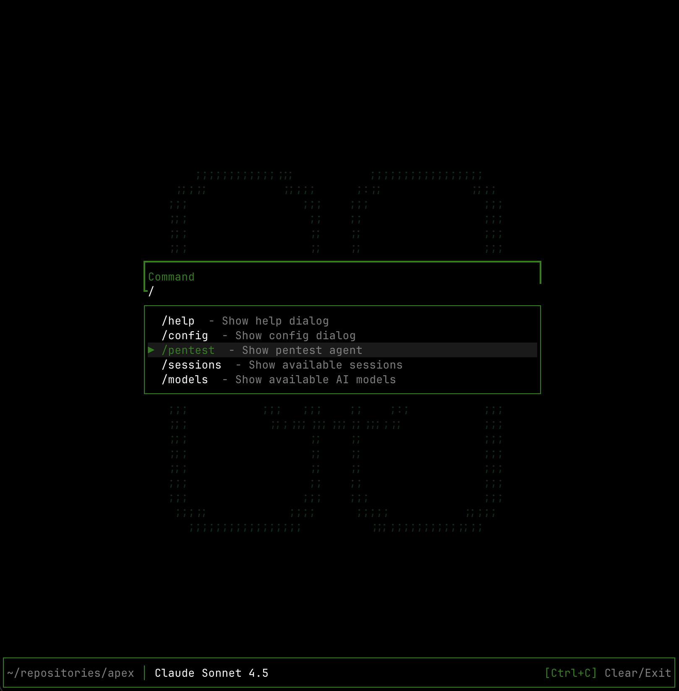

# Pensar Apex

<p align="center">
  
</p>

**Pensar Apex** is an AI-powered penetration testing CLI tool that enables you to use an AI agent to perform comprehensive black box testing.

## Installation

### Prerequisites

- **nmap** (required for network scanning)
- **API Key** for your chosen AI provider

#### Install nmap

macOS:

```bash
brew install nmap
```

Debian/Ubuntu:

```bash
sudo apt-get update && sudo apt-get install -y nmap
```

Fedora/RHEL:

```bash
sudo dnf install -y nmap
```

Windows:
Download installer from `https://nmap.org/download.html` and ensure `nmap` is on your PATH.

### Install Apex

```bash
npm install -g @pensar/apex
```

### Configuration

Set your AI provider API key as an environment variable:

```bash
export ANTHROPIC_API_KEY="your-api-key-here"
# or for other providers:
# export OPENAI_API_KEY="your-api-key-here"
# export AWS_ACCESS_KEY_ID="..." and AWS_SECRET_ACCESS_KEY="..."
```

## Usage

Run Apex:

```bash
pensar
```

## AI Provider Support

Apex supports **OpenAI**, **Anthropic**, **AWS Bedrock**, and **vLLM** (local models). **Anthropic models provide the best performance** and are recommended for optimal results.

## Kali Linux Container (Recommended)

For **best performance**, run Apex in the included Kali Linux container with preconfigured pentest tools:

```bash
cd container
cp env.example .env  # add your API keys
docker compose up --build -d
docker compose exec kali-apex bash
```

Inside the container, run:

```bash
pensar
```

**Note:** On Linux hosts, consider using `network_mode: host` in `docker-compose.yml` for comprehensive network scanning.

## vLLM Local Model Support

To use a local vLLM server:

1. Set the vLLM endpoint:

```bash
export LOCAL_MODEL_URL="http://localhost:8000/v1"
```

2. In the Apex Models screen, enter your model name in the "Custom local model (vLLM)" input.
