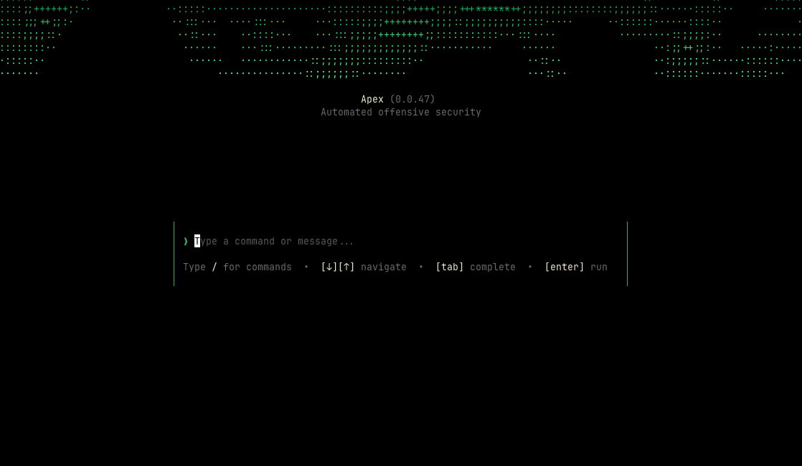

<h1 align="center">Pensar Apex</h1>

<p align="center">AI-powered penetration testing using an AI agent to perform comprehensive blackbox and whitebox pentesting - directly in your terminal.
</p>

<p align="center">
Want to run from the cloud or integrate it with your CI/CD? See <a href="https://docs.pensar.dev/console">Pensar Console</a>.
</p>

<p align="center">
  <a href="https://www.npmjs.com/package/@pensar/apex"></a>
  <a href="https://www.npmjs.com/package/@pensar/apex"></a>
  <!-- <a href="https://www.npmjs.com/package/@pensar/apex"></a> -->
  <a href="./LICENSE"></a>
  <a href="https://docs.pensar.dev/apex"></a>
  <a href="https://discord.gg/pensar"></a>
</p>

<!-- <p align="center">
  
</p> -->


## Use Cases

Apex enables both developers and security professionals to run autonomous and assisted penetration testing directly from the terminal.


### Developers: Run a Pentest in Minutes

Apex makes it easy for developers to run a real penetration test without needing deep offensive security expertise.

Using the autonomous `/pentest` mode, Apex will perform reconnaissance, attack surface discovery, vulnerability testing, and exploitation attempts automatically.

This allows teams to quickly identify security issues before they reach production.

```bash
/pentest
```

Examples:
- Test a staging environment before deploying
- Scan a newly launched domain or API
- Run quick security checks during development
- Identify exposed services or misconfigurations

This is the **fastest way to get real pentesting coverage without becoming a security expert.**

---

### Security Engineers: Advanced Operator Workflows

Security professionals can use Apex as an **agentic offensive security harness** that orchestrates tools and reasoning workflows.

The `/operator` mode allows engineers to work interactively with the Offensive Security Agent, guiding investigations and chaining tools dynamically.


```bash
/operator
```

Examples:
- Deep investigation of suspicious endpoints
- Manual exploitation of discovered vulnerabilities
- Tool orchestration across recon and exploitation phases
- Validation and reproduction of vulnerabilities
- Open-source security research / testing

This turns Apex into a **terminal-native AI pentesting partner** rather than just a scanner.

## Installation

#### macOS / Linux (Quick Install)

```bash
curl -fsSL https://pensarai.com/install.sh | bash
```

#### Homebrew

```bash
brew tap pensarai/tap
brew install apex
```

#### Windows (PowerShell)

```powershell
irm https://www.pensarai.com/apex.ps1 | iex
```

#### npm

```bash
npm install -g @pensar/apex
```

## Usage

Open the Apex TUI:

```bash
pensar
```

## Kali Linux Container (Optional)

For **best performance**, run Apex in the included Kali Linux container with preconfigured pentest tools:

```bash
cd container
cp env.example .env  # add your API keys
docker compose up --build -d
docker compose exec kali-apex bash
```

Inside the container, run:

```bash
pensar
```

---

### ⚠️ Responsible Use

This repository contains tools for **authorized security testing** only.  
Before use, please read and agree to the [Responsible Use Disclosure](./RESPONSIBLE_USE.md).
