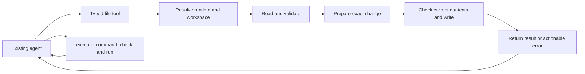

# Shared coding tools

Apex agents need to create and repair code in the same environment where they
execute it. A pentest worker might need a response parser, a protocol client, or a
reproducible test script during its existing mission. These operations belong in
the shared tool layer; they do not require a separate coding agent or a new
task router.

## The execution path



The agent still chooses its next tool call. The harness owns path resolution,
backend selection, bounded reads, predictable edits, and truthful failure
results. The existing command executor supplies exit status, output, timeout,
and cancellation information for the next repair attempt.

## Responsibilities

| Layer                    | Responsibility                                                                                                     | Why it matters                                                                                                 |
| ------------------------ | ------------------------------------------------------------------------------------------------------------------ | -------------------------------------------------------------------------------------------------------------- |
| File workspace           | Resolve paths against the intended runtime and optional file workspace; use the sandbox when one is supplied       | A file created remotely must be read and edited remotely, even if the host has a file with the same path       |
| Creation and exact edits | Exclusive creation by default; reject empty or ambiguous searches; require explicit `replaceAll`                   | The model can recover from an error instead of silently changing the wrong occurrence                          |
| Patches                  | Validate syntax and prepare all files before writes; locate unique matching context; return actual commit outcomes | A bad second file must not mutate the first during preparation; a later write failure must not claim rollback  |
| Read and search          | Preserve bounded results and continuation information; respect backend and file scope                              | The model can inspect relevant evidence without silently losing content or consuming the entire context window |
| Agent integration        | Give existing workers an owned helper directory and concise check/run/repair guidance                              | Coding becomes an inline capability of the current mission                                                     |

File-workspace confinement applies to these native file tools. It is not an
operating-system sandbox and does not restrict arbitrary commands. Existing
black-box instructions and runtime isolation remain separate controls.

Conditional writes detect changes since the tool prepared its replacement.
Cooperative locks serialize Apex mutations of the same file. Neither mechanism
turns a multi-file patch into a filesystem transaction or coordinates arbitrary
external programs. If a commit fails after another file was written, the receipt
must identify applied, failed, and unapplied files so the agent can re-read the
actual state.

Text mutations are limited to 1 MiB and reject binary or invalid UTF-8 files.
Remote file operations require Python 3 on Linux or PowerShell on Windows.
Confined Windows paths reject reparse points, device names, alternate streams,
and trailing dots/spaces. The existing sandbox interface has no cancellation
channel: cancellation is checked before dispatch, but an already dispatched
remote mutation may finish after cancellation. Apex awaits its outcome and does
not automatically retry it; cancellation is not a rollback guarantee.

## A helper-code workflow

1. The pentest worker creates a small helper in its assigned workspace.
2. It uses `execute_command` to syntax-check and run the helper in the current
   runtime, using the helper's resolved path.
3. A failure returns its exit status and captured output. The worker reads the
   relevant code, makes an exact edit or patch, and reruns the check.
4. It inspects the final output before using that result as evidence for its
   mission.

Credentials stay in runtime environment references. Generated helper source
should not contain literal credentials. Successful file creation is not evidence
that the program compiles, runs, or proves a vulnerability.

## Reproducing the tool benchmark

On macOS or Linux, run the same script against two clean checkouts with
dependencies installed:

```sh
bun scripts/bench-coding-tools.ts --checkout /path/to/baseline --output /tmp/coding-before.json
bun scripts/bench-coding-tools.ts --checkout /path/to/candidate --output /tmp/coding-after.json
```

The script creates and removes synthetic temporary files. It calls the real tool
factories from the selected checkout, verifies resulting bytes or rejection
behavior, and records every case. It also measures valid edit, patch, and read
calls after three warmup iterations, with 25 samples by default. Fixture setup
and assertions are outside the latency measurement; tool construction and result
execution are inside it. `--samples` changes the sample count.

The JSON includes commit identity, dirty state, runtime, planned/completed/passed
case counts, failures, median/p95 latency, and serialized result size. Result
size is bytes, not model tokens. Failures remain visible in the report; they do
not prevent the remaining correctness cases from running.

These are deliberately selected regression contracts, including valid operations
as controls. Their pass rate is not a general coding-task or pentest success rate.
Latency measures local warm execution on one machine, not provider latency or
cloud sandbox overhead. Sandbox-failure routing uses an unavailable sandbox and
a host decoy; it does not establish cloud or Windows runtime compatibility.
Behavioral tests provide additional coverage of the backend adapters and agent
wiring. Model-level evaluations and longitudinal capability scoring remain in
the separate evaluation service.

## Recorded comparison

Measured on September 24, 2026, using two clean checkouts on the same macOS arm64
host with Bun 1.3.14. Baseline: `72dbc8dddf7a0866b925ed7d71045be6535ea22c`. Candidate:
`b1e6e01094aef1cfd94d5c571bb0bedea7cee9f0`. Both completed all 17 planned contracts.

| Contract group                                                                  | Baseline | Candidate |
| ------------------------------------------------------------------------------- | -------: | --------: |
| Existing valid-operation controls, including a real helper run/repair loop      |      5/5 |       5/5 |
| Exact-edit ambiguity, empty search, CRLF/BOM, and exclusive-creation races      |      0/4 |       4/4 |
| Relocated context, malformed hunks, multi-file preflight, and final newlines    |      0/4 |       4/4 |
| Workspace routing, outside-path and symlink rejection, remote failure isolation |      0/4 |       4/4 |
| **Total selected contracts**                                                    | **5/17** | **17/17** |

Latency used 100 measured calls per tool after three warmup calls. Each input
file was 30,608 bytes and 1,024 lines. Edits and patches replace one line at line
513; reads request an 11-line window. These are local warm microbenchmarks on a
development machine, not a throughput or model-capability benchmark.

| Tool         | Baseline median / p95 (ms) | Candidate median / p95 (ms) | Result bytes before / after |
| ------------ | -------------------------: | --------------------------: | --------------------------: |
| `updateFile` |              0.123 / 0.155 |               0.868 / 1.344 |                   138 / 146 |
| `applyPatch` |              0.174 / 0.217 |               1.014 / 1.723 |                    91 / 142 |
| `readFile`   |              0.136 / 0.185 |               0.164 / 0.218 |                   489 / 489 |

The improvement here is correctness and runtime coverage. Mutations cost about
0.75–0.84 ms more at the median in this run because they perform additional path,
content, and conditional-write work. This comparison does not demonstrate a
speedup. Patch results grow because they include per-file commit receipts.

The complete tool/agent prefix passed 3,310 tests with 45 skipped locally, plus
typecheck, lint, format, dead-code, and build checks. Platform-gated Windows
contracts run separately in CI. Local subprocess adapters validate the commands
we send; they do not prove compatibility with a live cloud sandbox service.

## Explaining the change on a whiteboard

Start with the existing pentest worker, then draw four boxes beneath it:
**workspace → inspect → prepare change → commit and report**. Draw a separate
arrow from the worker to the existing command executor.

- The workspace selects the filesystem and owns path policy. A remote file tool
  must never silently inspect a host file.
- Inspection returns bounded evidence and a usable continuation or an explicit
  instruction to change the request.
- Preparation checks that the intended edit has one interpretation. A patch
  prepares every file before its first write.
- Commit checks the prepared baseline and returns what actually happened, so a
  failed call gives the worker enough information to recover.
- The worker runs the helper, observes its output, and repeats the loop as part
  of the current pentest. File creation alone does not prove the helper works.

These responsibilities live in reusable tools. Agent specialization can evolve
later without duplicating filesystem behavior or introducing a coding handoff
for every helper script.
