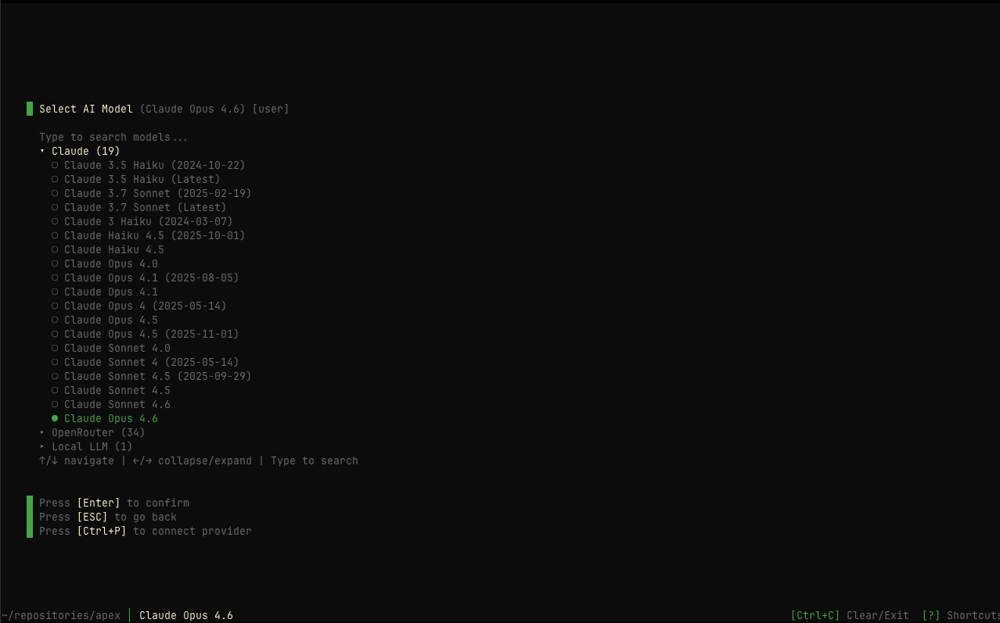

## Overview

The `/models` command opens the model selection interface where you can view available AI models grouped by provider and select which model Apex uses for penetration testing.

## Usage

```bash
/models
```

## How It Works

The models interface displays all available models from your configured providers, organized by provider name. You can navigate through the list and select your preferred model.

<Callout intent="info">
  Only models from **configured providers** are shown. Use `/providers` to set
  up additional AI providers, or `/auth` to connect via Pensar Console.
</Callout>



## Interface

When you open `/models`, you'll see:

- **Provider sections**: Models grouped by provider (Anthropic, OpenAI, Google, etc.)
- **Model list**: Available models under each provider
- **Selection indicator**: Current model highlighted with a bullet (●)
- **Show more/less**: Expand to see all models if a provider has many

## Keyboard Navigation

| Key        | Action                   |
| ---------- | ------------------------ |
| `[↑/↓]`    | Navigate between models  |
| `[Enter]`  | Select highlighted model |
| `[Ctrl+P]` | Open provider management |
| `[ESC]`    | Close and return home    |

## Supported AI Providers

<AccordionGroup>
  <Accordion title="Anthropic (Recommended)" icon="sparkles">
    **Best performance** for penetration testing tasks.
    
    Available models include:
    - Claude Sonnet 4.5 (Recommended)
    - Claude Opus 4.5
    - Claude Sonnet 4.0
    - Claude Haiku 4.5
    - Claude 3.7 Sonnet
    - Claude 3.5 Haiku
    - And more...

    <Callout intent="success">
      **Anthropic models are specifically recommended** for penetration testing due to their superior reasoning capabilities and context understanding.
    </Callout>

  </Accordion>

  <Accordion title="OpenAI" icon="openai" iconType="brands">
    Support for GPT and o-series models from OpenAI.

    Available models include:
    - GPT-4.1 / GPT-4.1 mini
    - GPT-4o / GPT-4o mini
    - o3 / o3-mini / o4-mini
    - And more...

  </Accordion>

  <Accordion title="Google" icon="google" iconType="brands">
    Gemini models via Google's Generative AI API.

    Available models include:
    - Gemini 2.5 Pro / Flash
    - Gemini 2.0 Flash
    - And more...

  </Accordion>

  <Accordion title="OpenRouter" icon="route">
    Access to models from multiple providers through a unified API.

    Benefits:
    - Single API for multiple providers
    - Pay-per-use pricing
    - Access to latest models from Anthropic, OpenAI, Google, Meta, and more

  </Accordion>

  <Accordion title="AWS Bedrock" icon="aws" iconType="brands">
    Enterprise-grade AI through AWS infrastructure.

    Available models:
    - Claude models via Bedrock
    - Amazon Nova models
    - Meta Llama models
    - And more...

    <Callout intent="info">
      Requires AWS credentials and Bedrock model access in your region.
    </Callout>

  </Accordion>

  <Accordion title="Pensar Console" icon="shield-check">
    Managed inference through Pensar Console — no API key required.

    Available models:
    - Claude Sonnet 4.5 / Opus 4.5
    - Claude Sonnet 4.0 / Opus 4.0
    - Claude Haiku 4.5
    - And more...

    Connect via `/auth` in Apex.

  </Accordion>
</AccordionGroup>

## Setting Up Providers

If no providers are configured, the models screen will show:

```
No providers configured.
Press Ctrl+P to connect a provider.
```

Click "Connect provider" or press `Ctrl+P` to open the provider management interface.

## Model Selection

<Steps>
  <Step title="Open Models">
    Run `/models` to open the model selection interface
  </Step>
  <Step title="Navigate">Use `↑/↓` arrows to browse available models</Step>
  <Step title="Select">Press `[Enter]` to select the highlighted model</Step>
  <Step title="Confirm">
    The interface closes and your selected model is now active
  </Step>
</Steps>

## Model Comparison

<CardGroup cols={2}>
  <Card title="Claude Sonnet 4.5" icon="trophy">
    **Recommended** - Best for: All penetration testing - Speed: Fast -
    Capability: Excellent - Cost: Moderate
  </Card>
  <Card title="Claude Opus 4.5" icon="star">
    **Maximum Capability** - Best for: Complex, thorough tests - Speed: Moderate
    - Capability: Maximum - Cost: Higher
  </Card>
  <Card title="GPT-4.1" icon="bolt">
    **Alternative Option** - Best for: OpenAI users - Speed: Fast - Capability:
    Very Good - Cost: Moderate
  </Card>
  <Card title="Claude Haiku 4.5" icon="feather">
    **Budget Option** - Best for: Quick tests, development - Speed: Very Fast -
    Capability: Good - Cost: Lower
  </Card>
</CardGroup>

## Performance Considerations

<Callout intent="info">
  **Model performance impacts**: - **Reasoning quality**: How well the AI
  understands security concepts - **Context handling**: Ability to track complex
  test scenarios - **Speed**: Time to complete testing runs - **Cost**:
  Per-token or subscription costs
</Callout>

### When to Use Each Model

| Use Case                   | Recommended Model             |
| -------------------------- | ----------------------------- |
| Production security audits | Claude Sonnet 4.5 or Opus 4.5 |
| Quick development testing  | Claude Haiku 4.5              |
| Enterprise with AWS        | Claude via Bedrock            |
| Budget-conscious testing   | Haiku or GPT-4o mini          |

## Troubleshooting

<AccordionGroup>
  <Accordion title="No models available" icon="circle-exclamation">
    **Issue**: No models showing in the selection
    
    **Solution**: 
    1. Press `Ctrl+P` to open provider management
    2. Configure at least one AI provider with a valid API key
    3. Return to `/models` to see available models
  </Accordion>

  <Accordion title="Provider not showing models" icon="server">
    **Issue**: Configured provider doesn't show any models

    **Solution**:
    1. Verify your API key is valid
    2. Check your account has credits/access
    3. For AWS Bedrock, ensure model access is enabled
    4. Try reconfiguring the provider in `/providers`

  </Accordion>

  <Accordion title="Model selection not saving" icon="floppy-disk">
    **Issue**: Selected model doesn't persist
    
    **Solution**:
    1. Ensure you press `[Enter]` to confirm selection
    2. Check that you have write permissions to config directory
    3. Restart Apex and try again
  </Accordion>
</AccordionGroup>

## Related Commands

<CardGroup cols={2}>
  <Card title="/providers" icon="plug" href="/apex/commands/providers">
    Configure AI provider API keys
  </Card>
  <Card title="/pentest" icon="play" href="/apex/commands/pentest">
    Start testing with your selected model
  </Card>
  <Card title="/help" icon="circle-question" href="/apex/commands/help">
    View all available commands
  </Card>
</CardGroup>
