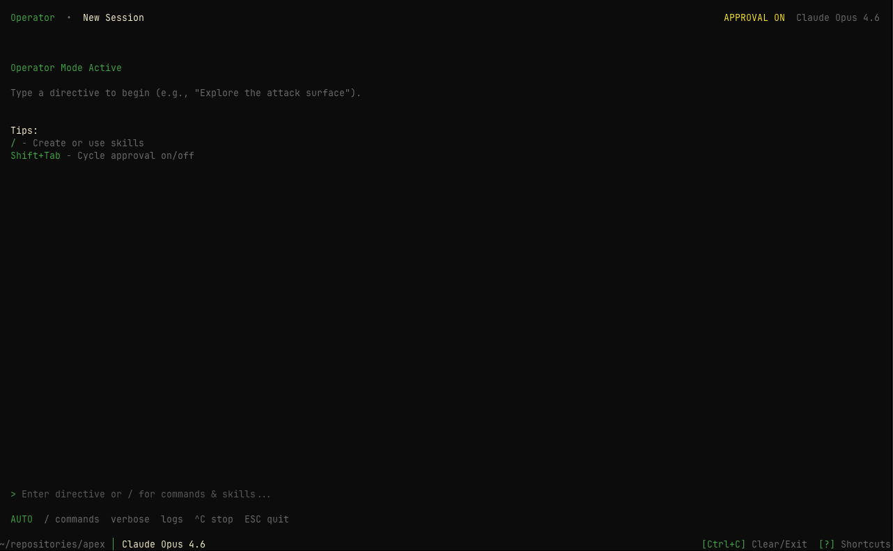
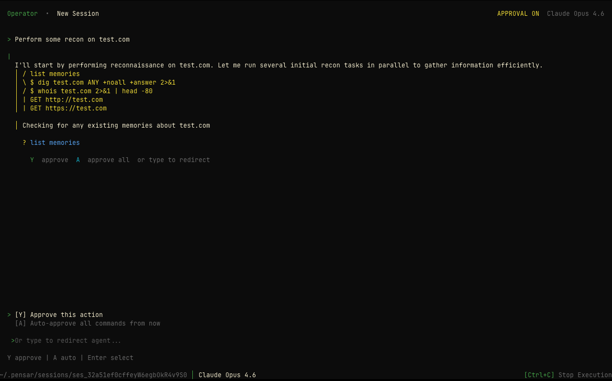

## Overview

The `/operator` command starts an interactive operator session where you work alongside the AI agent in real time. Unlike `/pentest` which runs autonomously, operator mode gives you step-by-step control over the testing process — you can approve actions, steer the agent's focus, and intervene at any point.

## Usage

```bash
/operator
```

With flags:

```bash
/operator --target https://example.com --mode auto
```

**Alias**: `/o`

## How It Works

<Steps>
  <Step title="Configure Target">
    Provide the target URL and optional authentication details.
  </Step>
  <Step title="Choose Mode">
    The agent starts in Default mode with all tools available. Press `Shift+Tab` to toggle Plan mode (read-only tools only). Toggle approval on/off with `Option+Shift+Tab`.
  </Step>
  <Step title="Interactive Session">
    The AI agent proposes actions and you approve, reject, or redirect in real
    time.
  </Step>
</Steps>



## Operator Modes

| Mode        | Description                                                                 |
| ----------- | --------------------------------------------------------------------------- |
| **Default** | All tools are available; the agent can read, write, and mutate targets      |
| **Plan**    | Read-only recon tools plus plan authoring — mutation tools are excluded so the agent can only observe and draft a plan |

You can toggle between Default and Plan mode at any time during a session using `Shift+Tab`. The current mode is shown in the operator dashboard header.

### Plan Review Workflow

When the agent is in Plan mode, it uses the `write_plan` and `submit_plan` tools to draft and propose a structured penetration testing plan. The workflow is:

1. The agent performs reconnaissance using read-only tools
2. It drafts a plan using `write_plan`, which saves a `plan.md` file in the session directory
3. It calls `submit_plan` to present the plan for your review
4. You can **approve** the plan (the agent switches to Default mode and executes it) or **reject** it with feedback (the agent refines the plan)

Plans persist across sessions — when you resume a session that had an unapproved plan, you'll re-enter Plan mode to review it.

<Callout intent="info">
  **Plan mode** is useful for reviewing the agent's strategy before allowing any mutations. Start in Plan mode to understand the agent's approach, then approve the plan when you're ready for the agent to take action.
</Callout>

### Approval Control

In addition to operating mode, you can toggle whether tool calls require your approval:

- **Approval on** — the agent pauses before each tool call and waits for you to approve (`Y`) or auto-approve (`A`)
- **Approval off** — tool calls execute automatically

Toggle approval with `Option+Shift+Tab` (or `Alt+Shift+Tab` on Linux/Windows).

## Command Flags

| Flag                  | Description                                       |
| --------------------- | ------------------------------------------------- |
| `--target <url>`      | Target URL to test                                |
| `--name <name>`       | Session name                                      |
| `--mode <mode>`       | Operator mode: plan, manual, or auto              |
| `--autopilot`         | Disable approval gates (auto-approve all actions) |
| `--model <model>`     | AI model to use                                   |
| `--auth-url <url>`    | Login page URL                                    |
| `--auth-user <user>`  | Auth username                                     |
| `--auth-pass <pass>`  | Auth password                                     |
| `--auth-instructions` | Custom auth instructions                          |
| `--hosts <h1,h2,...>` | Allowed hosts (comma-separated)                   |
| `--ports <p1,p2,...>` | Allowed ports (comma-separated)                   |
| `--strict`            | Enable strict scope mode                          |
| `--headers <mode>`    | Headers mode: none, default, or custom            |
| `--header <Name:Val>` | Custom header (repeatable)                        |
| `--sandbox`           | Use isolated session directory as working directory instead of current directory |

## Keyboard Shortcuts

| Key                | Action                                  |
| ------------------ | --------------------------------------- |
| `Shift+Tab`        | Toggle between Default and Plan mode    |
| `Option+Shift+Tab` | Toggle approval on/off                  |
| `Ctrl+V`           | Toggle verbose output                   |
| `Ctrl+L`           | Toggle expanded logs                    |
| `Ctrl+C`           | Abort running agent / clear input       |
| `Y`                | Approve pending tool call or plan       |
| `N`                | Reject pending plan (with feedback)     |
| `A`                | Auto-approve all remaining tool calls   |
| `Escape`           | Exit operator session (when idle)       |

## When to Use /operator vs /pentest

<CardGroup cols={2}>
  <Card title="/pentest" icon="play">
    **Autonomous mode** — set a target and let the AI agent swarm run
    independently. Best for comprehensive, hands-off testing.
  </Card>
  <Card title="/operator" icon="terminal">
    **Interactive mode** — guide the AI agent step by step. Best for targeted
    investigations, learning, or sensitive environments.
  </Card>
</CardGroup>

| Scenario                         | Recommended |
| -------------------------------- | ----------- |
| Full security audit              | `/pentest`  |
| Investigating a specific feature | `/operator` |
| First time testing a target      | `/operator` |
| CI/CD automated scanning         | `/pentest`  |
| Sensitive production environment | `/operator` |
| Broad vulnerability discovery    | `/pentest`  |

## Example Workflow

```bash
# Start Apex
pensar

# Launch operator session
/operator

# Or with flags for quick start
/operator --target https://api.example.com --mode manual

# In the session:
# - The agent proposes reconnaissance actions
# - You approve or redirect
# - Review findings as they come in
# - Steer toward specific areas of interest
```



## Operator Skills

You can extend operator mode with custom skills using `/create-skill`. Skills are reusable instruction sets that teach the agent specialized testing techniques or workflows for your specific environment.

## Best Practices

<Callout intent="success">
  **Tips for Operator Mode**: 1. **Start in Plan mode** (`Shift+Tab`) to review the agent's
  strategy with read-only tools before allowing mutations 2. **Enable approval**
  (`Option+Shift+Tab`) for sensitive targets where you want to approve each action 3.
  **Switch to Default mode** once you're comfortable with the agent's approach 4.
  **Create skills** for repetitive testing patterns in your environment
</Callout>

<Callout intent="warning">
  **Security Reminder**: Only test systems you own or have explicit
  authorization to test. Unauthorized testing is illegal.
</Callout>

## After Starting

Once you start an operator session:

- The AI agent begins analysis based on your chosen mode
- You interact in real time, approving or steering actions
- Findings are reported as they're discovered
- The session is automatically saved and can be resumed via `/resume`

## Related Commands

<CardGroup cols={2}>
  <Card title="/pentest" icon="play" href="/apex/commands/pentest">
    Run an autonomous pentest instead
  </Card>
  <Card title="/resume" icon="clock-rotate-left" href="/apex/commands/sessions">
    Browse and resume previous sessions
  </Card>
  <Card title="/models" icon="microchip" href="/apex/commands/models">
    Select AI model before starting
  </Card>
  <Card title="/providers" icon="plug" href="/apex/commands/providers">
    Configure AI provider API keys
  </Card>
</CardGroup>
