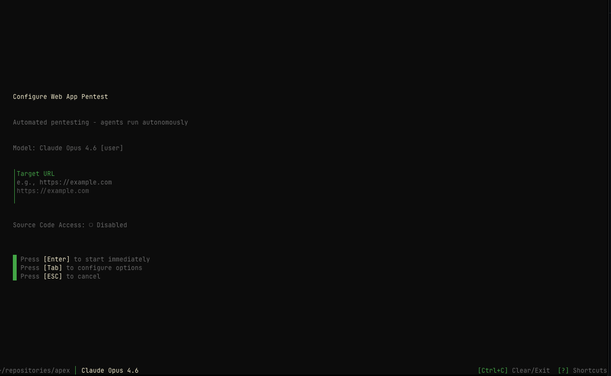
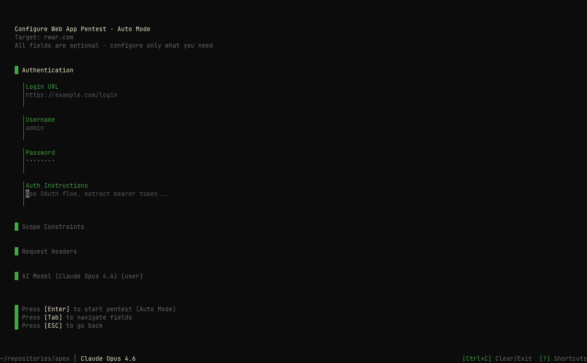

## Overview

The `/pentest` command launches the pentest wizard, guiding you through configuring and starting an autonomous penetration test. Apex deploys a swarm of AI agents that collaboratively test your target for vulnerabilities.

## Usage

```bash
/pentest
```

With flags (skip the wizard):

```bash
/pentest --target https://example.com --tier 3
```

**Aliases**: `/p`, `/web`, `/w`

## How It Works

When you run `/pentest`, Apex presents a streamlined wizard that walks you through:

<Steps>
  <Step title="Target Configuration">
    Enter your session name and target URL. The session name is auto-generated
    but can be customized.
  </Step>
  <Step title="Optional Configuration">
    Press `[Tab]` to access advanced configuration options, or press `[Enter]`
    to start immediately with defaults.
  </Step>
  <Step title="Session Creation">
    Apex creates the session and deploys an autonomous AI agent swarm against
    your target.
  </Step>
</Steps>



## Target Step

The first step collects basic information:

### Session Name

An auto-generated name like `swift-falcon` that identifies your session. Edit this if you prefer a custom name.

### Target URL

The primary URL to test, e.g., `https://example.com`. This is required to start the test.

<Callout intent="info">
  **Quick Start**: Enter your target URL and press `[Enter]` to begin testing
  immediately with default settings.
</Callout>

## Optional Configuration

Press `[Tab]` from the target step to access advanced configuration options:

### Authentication

Configure credentials for authenticated testing:

<AccordionGroup>
  <Accordion title="Login URL" icon="link">
    The URL of the login page, e.g., `https://example.com/login`
  </Accordion>

<Accordion title="Username & Password" icon="key">
  Credentials for authenticating to the target application. These are used to
  test authenticated functionality.
</Accordion>

  <Accordion title="Auth Instructions" icon="clipboard">
    Custom authentication instructions for complex login flows, e.g., "Use OAuth flow, extract bearer token..."
  </Accordion>
</AccordionGroup>

### Scope Constraints

Define boundaries for the penetration test:

<CardGroup cols={2}>
  <Card title="Allowed Hosts" icon="server">
    Specific hostnames the agent is allowed to test. Add multiple hosts by
    pressing Enter after each.
  </Card>
  <Card title="Allowed Ports" icon="plug">
    Specific ports to include in testing scope (e.g., 443, 8080).
  </Card>
</CardGroup>

**Strict Scope**: When enabled, the agent will only test explicitly allowed hosts and ports. Use `↑/↓` to toggle.

### Request Headers

Configure how the agent identifies itself:

| Mode        | Description                     |
| ----------- | ------------------------------- |
| **None**    | No identifying headers are sent |
| **Default** | Sends `User-Agent: pensar-apex` |
| **Custom**  | Define your own custom headers  |

For custom headers, you can add multiple key-value pairs.

## Command Flags

You can bypass the wizard entirely by passing flags:

| Flag                  | Description                            |
| --------------------- | -------------------------------------- |
| `--target <url>`      | Target URL to test                     |
| `--name <name>`       | Session name                           |
| `--tier <1-5>`        | Auto-approve permission tier           |
| `--model <model>`     | AI model to use                        |
| `--auth-url <url>`    | Login page URL                         |
| `--auth-user <user>`  | Auth username                          |
| `--auth-pass <pass>`  | Auth password                          |
| `--auth-instructions` | Custom auth instructions               |
| `--hosts <h1,h2,...>` | Allowed hosts (comma-separated)        |
| `--ports <p1,p2,...>` | Allowed ports (comma-separated)        |
| `--strict`            | Enable strict scope mode               |
| `--headers <mode>`    | Headers mode: none, default, or custom |
| `--header <Name:Val>` | Custom header (repeatable)             |

## Keyboard Navigation

| Key           | Action                                                  |
| ------------- | ------------------------------------------------------- |
| `[Tab]`       | Move to next field or access configuration              |
| `[Shift+Tab]` | Move to previous field                                  |
| `[Enter]`     | Start pentest (from target step) or add item (in lists) |
| `[↑/↓]`       | Toggle options (strict scope, header mode)              |
| `[ESC]`       | Go back or cancel                                       |

## Example Workflow

```bash
# Start Apex
pensar

# Launch pentest wizard
/pentest

# Enter session details:
# Session Name: production-api-test
# Target URL: https://api.example.com

# Press Enter to start immediately
# OR press Tab to configure authentication, scope, and headers
```

## Best Practices

<Callout intent="success">
  **Tips for Effective Testing**: 1. **Use descriptive session names** to easily
  identify tests later 2. **Configure authentication** for testing protected
  endpoints 3. **Define scope constraints** to stay within authorized boundaries
  4. **Use custom headers** if the target requires specific identification
</Callout>

<Callout intent="warning">
  **Security Reminder**: Only test systems you own or have explicit
  authorization to test. Unauthorized testing is illegal.
</Callout>



## After Starting

Once you start a session:

- The AI agent swarm begins reconnaissance on your target
- Real-time progress is displayed in the terminal
- Vulnerabilities are reported as they're discovered
- The session is automatically saved for later review via `/resume`

## See Also: /operator

For more hands-on control, use `/operator` to start an interactive session where you guide the AI agent step by step. The operator mode supports plan, manual, and auto modes.

## Related Commands

<CardGroup cols={2}>
  <Card title="/models" icon="microchip" href="/apex/commands/models">
    Select AI model before starting a test
  </Card>
  <Card title="/providers" icon="plug" href="/apex/commands/providers">
    Configure AI provider API keys
  </Card>
  <Card title="/help" icon="circle-question" href="/apex/commands/help">
    View all available commands
  </Card>
</CardGroup>
