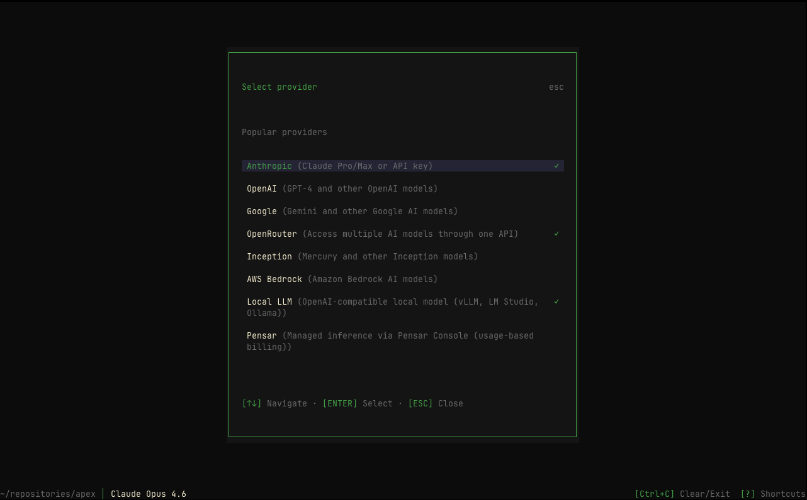
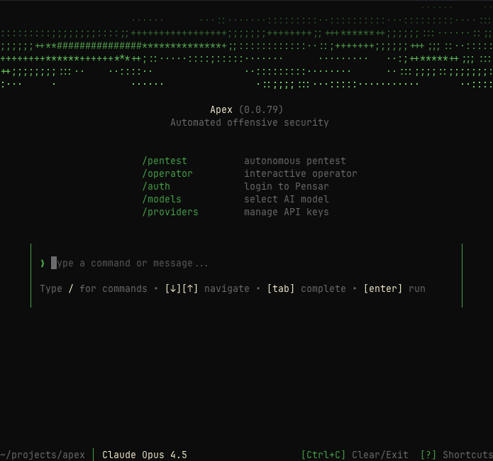

## Prerequisites

- **API Key** for your chosen AI provider (Anthropic recommended)

<Callout intent="info">
  After installing, run `pensar doctor` to check for optional dependencies (like
  nmap) and install them automatically.
</Callout>

## Installation

Install Apex using your preferred method:

<Tabs>
  <Tab title="macOS/Linux">
    ```bash curl -fsSL https://pensarai.com/install.sh | bash ```
  </Tab>
  <Tab title="Homebrew">
    ```bash brew tap pensarai/tap brew install apex ```
  </Tab>
  <Tab title="Windows">
    ```powershell irm https://www.pensarai.com/apex.ps1 | iex ```
  </Tab>
  <Tab title="npm">
    ```bash npm install -g @pensar/apex ``` Requires
    [Node.js](https://nodejs.org)
  </Tab>
</Tabs>

<Callout intent="success">
  Apex is now installed! You can run it from anywhere by typing `pensar` in your
  terminal.
</Callout>

## Configuration

Before running Apex, you need to configure your AI provider API key. Apex supports multiple providers, but **Anthropic is recommended** for best results.

<AccordionGroup>
  <Accordion title="Anthropic (Recommended)" icon="sparkles">
    Get your API key from [console.anthropic.com](https://console.anthropic.com/).

    <Callout intent="success">
      Anthropic models (especially Claude Sonnet 4.5) provide the best performance for penetration testing tasks.
    </Callout>

  </Accordion>

  <Accordion title="OpenAI" icon="openai" iconType="brands">
    Get your API key from [platform.openai.com](https://platform.openai.com/).

  </Accordion>

  <Accordion title="Google" icon="google" iconType="brands">
    Get your API key from [aistudio.google.com](https://aistudio.google.com/).

    Google provides access to Gemini models through the Generative AI API.

  </Accordion>

  <Accordion title="OpenRouter" icon="route">
    Get your API key from [openrouter.ai](https://openrouter.ai/).

    OpenRouter provides access to multiple AI models through a single API.

  </Accordion>

  <Accordion title="AWS Bedrock" icon="aws" iconType="brands">
    Configure AWS credentials with Bedrock access.

    Ensure you have access to Anthropic Claude models in AWS Bedrock.

  </Accordion>

  <Accordion title="Pensar Console (Managed)" icon="shield-check">
    Use the `/auth` command inside Apex to connect to [Pensar Console](https://console.pensar.dev) for managed inference — no API key required.

  </Accordion>
</AccordionGroup>



<Callout intent="info">
  **Tip:** You'll configure your API key directly in Apex using the `/providers`
  command — no environment variables needed!
</Callout>

## Running Apex

Launch Apex by running:

```bash
pensar
```

This will start the interactive terminal interface where you can access all Apex commands.



## CLI Commands

Apex also supports headless CLI commands for CI/CD and scripting:

```bash
pensar pentest --target <url>               # Run a full pentest orchestration
pensar targeted-pentest --target <url>      # Run a targeted pentest
pensar auth login                           # Connect to Pensar Console from the CLI
pensar auth status                          # Show current auth connection status
pensar auth logout                          # Disconnect from Pensar Console
pensar projects                             # List workspace projects
pensar pentests <projectId>                 # List/get/dispatch pentests
pensar issues <projectId>                   # List/get/update security issues
pensar fixes <issueId>                      # List/get security fixes
pensar logs <issueId>                       # List/search agent execution logs
pensar upgrade                              # Update to the latest version
pensar doctor                               # Check & install optional dependencies
pensar uninstall                            # Fully remove Pensar (interactive)
pensar uninstall --force                    # Fully remove Pensar (no confirmation)
```

## Using Kali Linux Container (Optional)

For **best performance** and maximum compatibility with security tools, we recommend running Apex in the included Kali Linux container:

<Steps>
  <Step title="Clone the Repository">
    ```bash git clone https://github.com/pensarai/apex.git cd apex/container ```
  </Step>
  <Step title="Configure Environment">
    ```bash cp env.example .env # Edit .env and add your API keys ```
  </Step>
  <Step title="Start Container">```bash docker compose up --build -d ```</Step>
  <Step title="Enter Container">
    ```bash docker compose exec kali-apex bash ```
  </Step>
  <Step title="Run Apex">Inside the container, run: ```bash pensar ```</Step>
</Steps>

<Callout intent="info">
  **Linux Users:** Consider using `network_mode: host` in `docker-compose.yml`
  for comprehensive network scanning capabilities.
</Callout>

## First Steps

Now that Apex is installed, here's how to get started:

<Steps>
  <Step title="Login to Pensar">
    Run `/auth` to login to Pensar.
  </Step>
  <Step title="Select Model">
    Run `/models` to choose which AI model to use
  </Step>
  <Step title="Start Testing">
    Run `/pentest` to launch an autonomous penetration test, or `/operator` for
    an interactive session
  </Step>
</Steps>

<CardGroup cols={2}>
  <Card title="/pentest" icon="play">
    Launch an autonomous penetration testing swarm against your target.
  </Card>
  <Card title="/operator" icon="terminal">
    Start an interactive operator session with step-by-step control.
  </Card>
  <Card title="/providers" icon="plug">
    Connect your AI provider and configure API keys.
  </Card>
  <Card title="/models" icon="microchip">
    Select which AI model to use for testing.
  </Card>
</CardGroup>

## Next Steps

<CardGroup cols={2}>
  <Card title="Commands Reference" icon="terminal" href="/apex/commands/help">
    Learn about all available commands in Apex.
  </Card>
  <Card title="AI Providers" icon="plug" href="/apex/commands/providers">
    Configure your AI provider for testing.
  </Card>
  <Card title="Model Selection" icon="microchip" href="/apex/commands/models">
    Choose the right AI model for your needs.
  </Card>
  <Card title="Start Testing" icon="play" href="/apex/commands/pentest">
    Launch your first penetration test.
  </Card>
</CardGroup>

## Optional Integrations

### W&B Weave Tracing

Apex can stream agent trace records to [Weights & Biases Weave](/apex/integrations/wandb) for observability and fine-tuning data collection. Set the `WANDB_API_KEY` and `WANDB_ENTITY` environment variables and tracing activates automatically during operator sessions.

See the [W&B Weave integration guide](/apex/integrations/wandb) for details.

## Need Help?

If you encounter any issues or have questions, reach out to our support team at [team@pensarai.com](mailto:team@pensarai.com).
